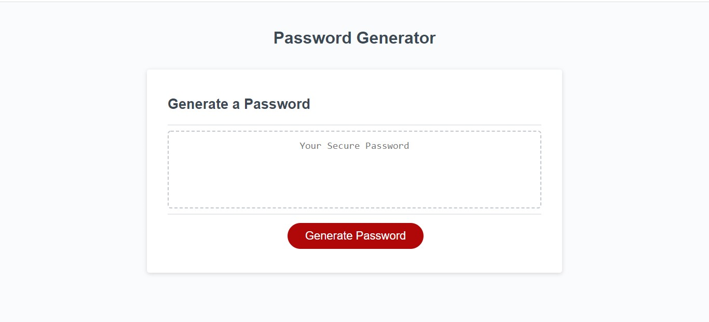

# Password-Generator

This application is a password generator that allows the user to customize the length and characters of a randomly generated password. Characters include numbers, special characters, and upper and lower case letters. Javascript was used for arrays, window prompts, and functions. 

